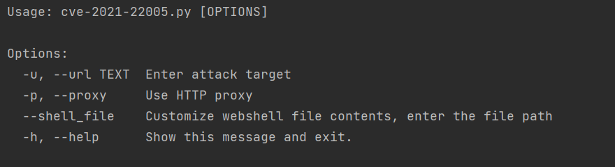

# CVE-2021-22005
# VMware vCenter Server任意文件上传漏洞

## Code By:Jun_sheng @橘子网络安全实验室

橘子网络安全实验室 https://0range.team/

#### 0x00 风险概述

本工具仅限授权安全测试使用,禁止未授权非法攻击站点

在线阅读[《中华人民共和国网络安全法》](http://wglj.pds.gov.cn//upload/files/2020/4/1415254915.docx)

#### 0x01 工具使用

python cve-2021-22005.py -h获取使用帮助

#### 0x02 Bug问题

Bug请提交Issues，有时间会看的

#### 0x03 已知Bug

在使用代理的情况下利用过程中所有步骤均失败

#### 0x04 版本迭代

v0.2 更新内容

> 更新初版默认webshell，更改为工具可连接的冰蝎的jsp的webshell，并增加上传自定义webshell功能。感谢[@Tas9er](https://github.com/Tas9er)师傅提供的webshell，除此之外删除自带的类bash_shell功能
